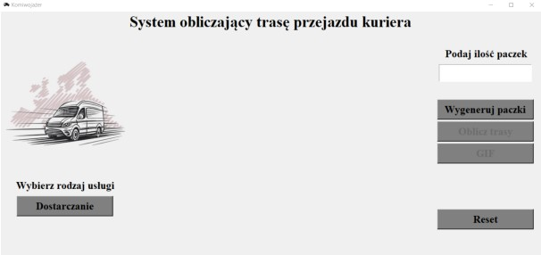

# Optimization of the courier company's work - CVRPPD problem Project :book::truck::world_map:

### Description of the problem

The purpose of the project execution is to create software to optimize the work of the courier company, the problem of which boils down to solving the the theme of the commuter with an additional limitation related to the load capacity of a single vehicle

### Implementation of the algorithm

The main idea behind the type of application created was ease of use by the user and the transparency associated with the presentation of results in the form of a simple graph. In the application, the user has the ability to choose the route optimization action between a problem related only to the retrieval of packages, or a problem in which packages which parcels can also be delivered, moreover, he has the possibility to define the number of customers, start optimization selecting the route with the lowest possible cost, display an animation of creating a point-by-point route, and the ability to reset the program, the purpose of which purpose will be to enter new data. In order to achieve the best optimized route, the Gurobi solver library was used, which will enable us to minimize the cost of our model, through its proper implementation in the code. Its use will enable a much faster and more efficient process of generating an optimization solution relative to an in-house implementation of such a solver.

### Operation of the program

The program will randomly generate points on the map and assign random weights to parcels, such action makes the application universal and the possibility of assigning real values later. In order to get a clear graph, the user will have to enter the number of parcels after turning on the application. 

After entering the number of parcels, which is equivalent to the number of customers, he can select the type of 
service, whether it will be delivery or delivery and pickup.

Generate parcels, the maximum number of which is 40 (this is due to the limited 
computational capabilities associated with the student license for the optimization library) results in a graph in which the red center dot represents the base, the blue dots are the places where parcels are delivered, and the yellow dots are the places where parcels are picked up. In the case of the delivery service, there will be only blue dots.

The result of the program is the drawing of routes, with each new trip from the vehicle base represented by a new color. Calling the GIF button will make it possible to present the the plotting of the route point by point.

